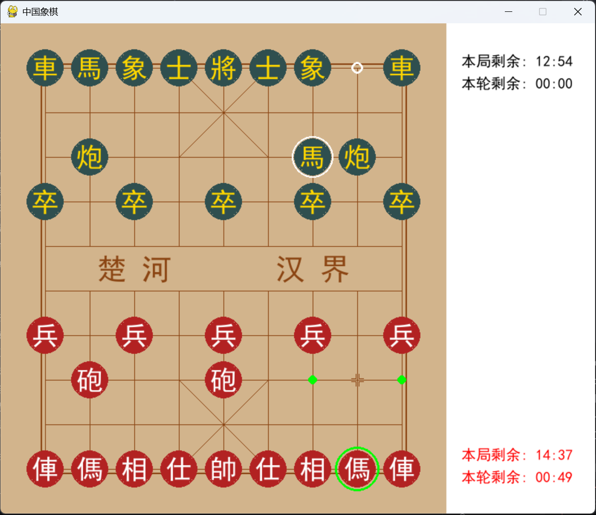

# 中国象棋游戏

一个基于Python和Pygame实现的中国象棋游戏，支持本地双人对战和基础游戏功能。



## 移动规则

- 將、帥：宫内直线移动，每次一格，不能离宫
- 士、仕：宫内斜线移动，每次一格，不能离宫
- 象、相：走"田"字，不能过河，若"田"字中心有子则不能移动（蹩象腿）
- 馬、傌：走"日"字，先直一格再斜一格，若前进方向有子则不能移动（蹩马腿）
- 車、俥：直线任意格数移动，不能越障
- 炮、砲：移动同车，吃子需隔一子（炮架）
- 卒、兵：未过河只能前进一格，过河后可前进或横移一格，不能后退
- ⚠️ 將帥不能碰面（中间无子阻挡）

## 功能特性

- 🎨 简洁的图形界面（Pygame渲染）
- ⚖️ 完整的中国象棋规则实现
- ♟️ 支持红黑双方轮流走棋
- 📌 支持棋子移动、吃子、将军、判负等基本功能
- 🔄 支持悔棋功能
- 💡 合法走法高亮提示
- ⚔️ 将军提示功能
- 🏆 游戏胜负判定（将/帅被吃）

## 未来计划

- 📜 棋谱保存与回放功能
- 🕒 限定时间模式
- 💾 保存/加载游戏进度功能
- 🤖 人机对战功能
- 🌐 网络对战模块
- 🏁 残局挑战模式
- 🎨 棋盘及棋子皮肤
- ✨ 游戏动画
- 🔊 游戏音效
- ⌨️ 快捷键支持及自定义

## 操作说明

- 左键点击棋子选择/移动
 - 💡 游戏会自动提示合法走法
 - ⚔️ 游戏会自动提示将军状态
 - 🏆 游戏会自动判断胜负
- 右键点击取消选择
- 按 `Backspace` 键进行悔棋
- 按 `R` 键重新开始游戏
- 按 `Q` 或 `Esc` 键退出游戏
- 按 `S` 键保存游戏（暂不支持）
- 按 `L` 键加载游戏（暂不支持）
 - ⚠️ 注意：中文输入下无法识别部分按键

## 运行环境

- Python 3.8+ (推荐3.8.10)
- Pygame 2.1.2+ (推荐2.1.3)

## 安装与运行

1. 克隆仓库：
```bash 
git clone https://github.com/eivatlbetas/chinese_chess_game.git
```

2. 安装依赖：
```bash
pip install pygame
```

3. 运行游戏：
```bash
python main.py
```

## 项目结构

```
chinese_chess_game/
├── board.py       # 棋盘逻辑
├── piece.py       # 棋子逻辑 
├── recorder.py    # 棋谱记录
├── main.py        # 主程序入口
├── view.py        # 图形界面
├── screenshot.png # 游戏截图
└── README.md      # 项目说明
```

## 开发者

[杨泽宇] - [eivatlbetas@163.com]

## 许可证

```
GPL License
```